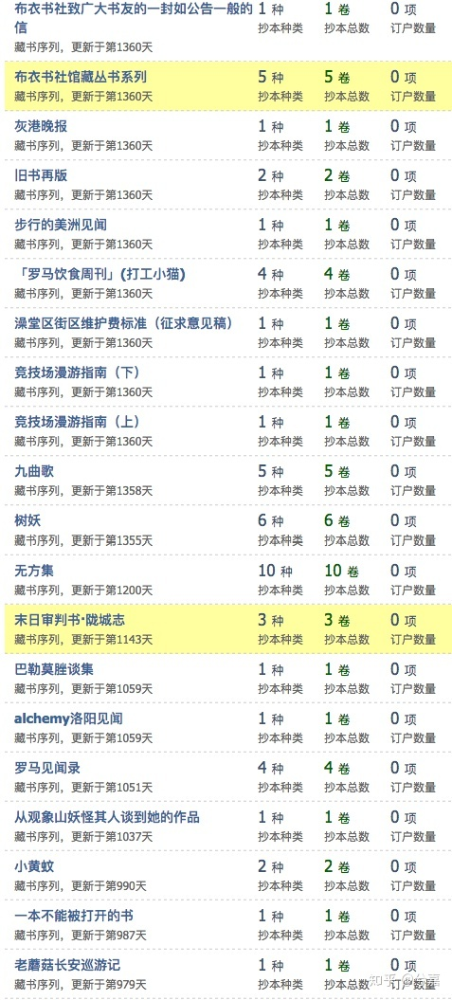
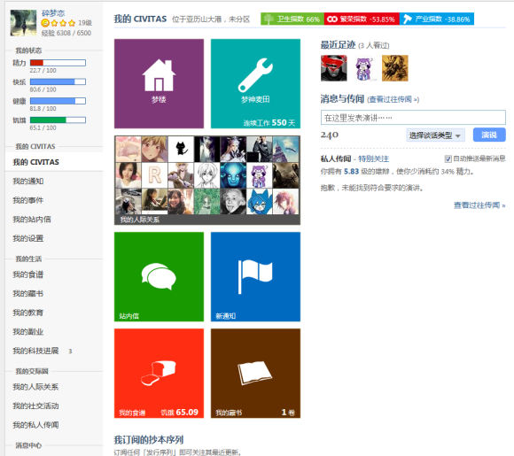
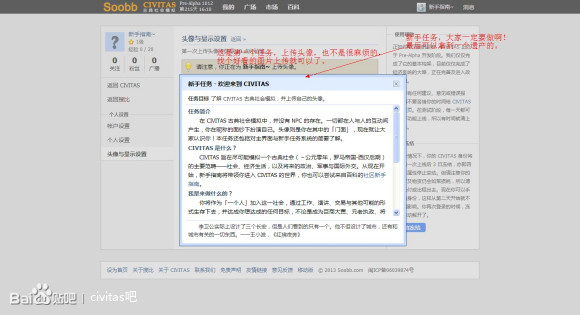
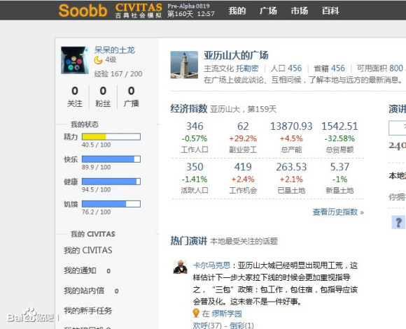
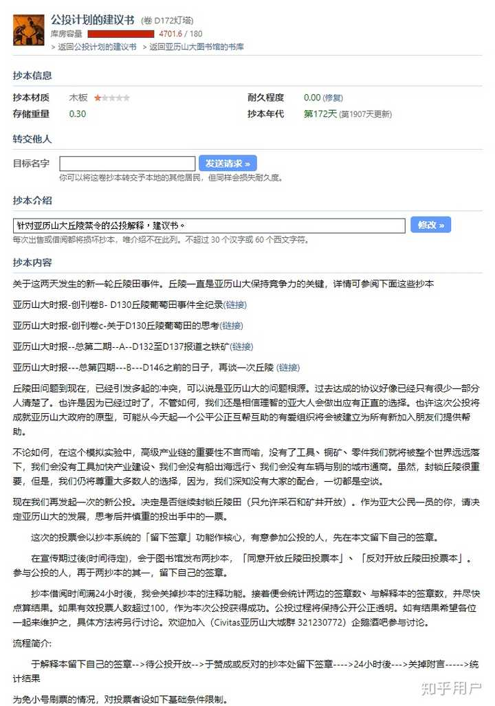
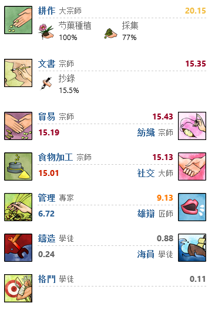
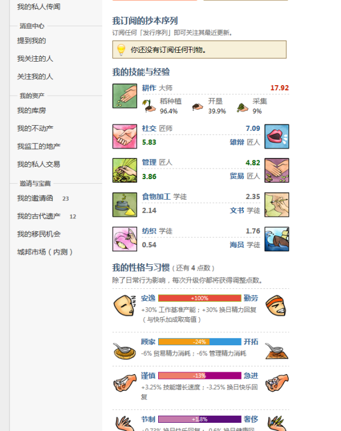
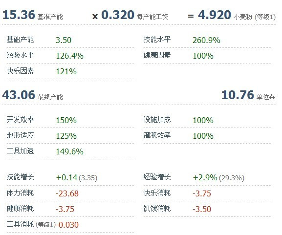

# civitas_monument
A monument for CIVITAS from Day 1 to Day 1449

CIVITAS是[陈约翰](https://www.sesp.northwestern.edu/learning-sciences/john-yuehan-chen.html)先生在北京及福州所创建的古典社会模拟项目, 曾经托管在[搜比](civitas.soobb.com). 在2013~2015年间有比较多的用户聚集，并衍生出了一系列故事。如今这一项目似已销声匿迹，服务器(小霸王)无法访问，许多昔日的玩家已经过上了全新的生活，但有一些记忆仍可以在这里寻找。我是雨尽荼蘼，在项目内的ID为16463，曾活跃在模拟项目中的长安, 也参与了文言文翻译、civ2制作等子项目的工作。

## CIVITAS相关介绍：
 - [网易游戏报道](https://ent.163.com/17/0427/20/CJ2930MG00318QE8.html)
 - [杜子腾的回答](https://www.zhihu.com/question/276042702/answer/389287750)
 - [Civitas古典社会模拟是一个怎样的游戏](https://www.zhihu.com/question/22665146)
 - 如果有任何CIVITAS背景知识/图片，关于本部分的补充，也可以随时更改放在这里
 
## 关于目前的数据
- Speech 文件夹中是Day1~Day1449的所有演讲，每一天为一个单独的文件，以Json格式存储
  - 每一天的Json包括目前我还能恢复的各地的演讲，每一条演讲中有如下字段
    - "speech_id":这个演讲在CIVITAS数据库中的id
    - "user_id": 演讲者的用户id
    - "user_name":演讲者的用户名
    - "speech_corpus":演讲内容
    - "num_approves":这条演讲获得的赞同数量
    - "num_follows":这条演讲获得的关注数量
    - "num_opposes":这条演讲获得的反对数量
    - "published_date":这条演讲的发布日期(CIVITAS历，即Day d,非真实时间),
    - "published_time":这条演讲的发布时间
    - "published_place":这条演讲的发布位置(CIVITAS位置，非发布IP对应位置)
  - 可以使用github的搜索功能或者下载到本地进行对应的搜索
  - 另外，JSON格式方便程序化处理，所以你也可以使用任何编程语言进行更精细的处理。
  - 假如你不知道怎么操作JSON，使用记事本/在线打开只有一行太丑陋了，你可以先打开一个json文件，复制所有内容，然后拷贝到[这个网站](https://www.bejson.com)上，再点击*格式化校验*，就可以看到格式化后的结果，然后你可以再进行搜索。
- cityStatistics.xlsx 是几个主要城市的经济数据统计 城市ID和城市名的对应关系在表格第二个sheet
- civitasPeoples.csv是用户表，从ID1到ID48531,包含了 用户名	等级	省籍	文化	文化组	关系数目	演讲数目	邀请人数等信息
- 比较可惜的是，虽然我个人保存了非常多的抄本(可能是civitas中最多的)，但是忘记备份了。**抄本**是civitas的精华，是无数公民智慧的结晶。如果任何人保存了任何抄本信息可以直接在这个项目中更新，或者联系[项目作者](yujintumi@qq.com)，聚沙成塔，集腋成裘。

## 昔日剪影

## 关于后续
 - 显然，目前civitas已经停止活动了，但是故事并没有结束。 
   - 假如你是civitas昔日的公民，能够说服[原制作者](YuehanChen2023@u.northwestern.edu)开源此项目，[本项目作者](yujintumi@qq.com)可以提供稳定的服务器托管服务，让civitas重新跑起来。
   - 假如你有重新/继续开发的意愿, 亦可以联系原作者和本项目作者，七八年过去了，许多新的框架将使得开发更为简单，本项目作者将尽力配合你的工作。
   - 假如你不会写代码，但是有其他这里未收集的记忆(抄本、集团信息等)，亦可以联系作者更新此仓库。

#### CIVITAS作者及其用户拥有这些数据的所有权利，本项目仅对这些数据进行展示，不对其声索任何权利，亦不承担任何法律责任。如有侵权内容请Pull Requests联系作者删除，谢谢。
